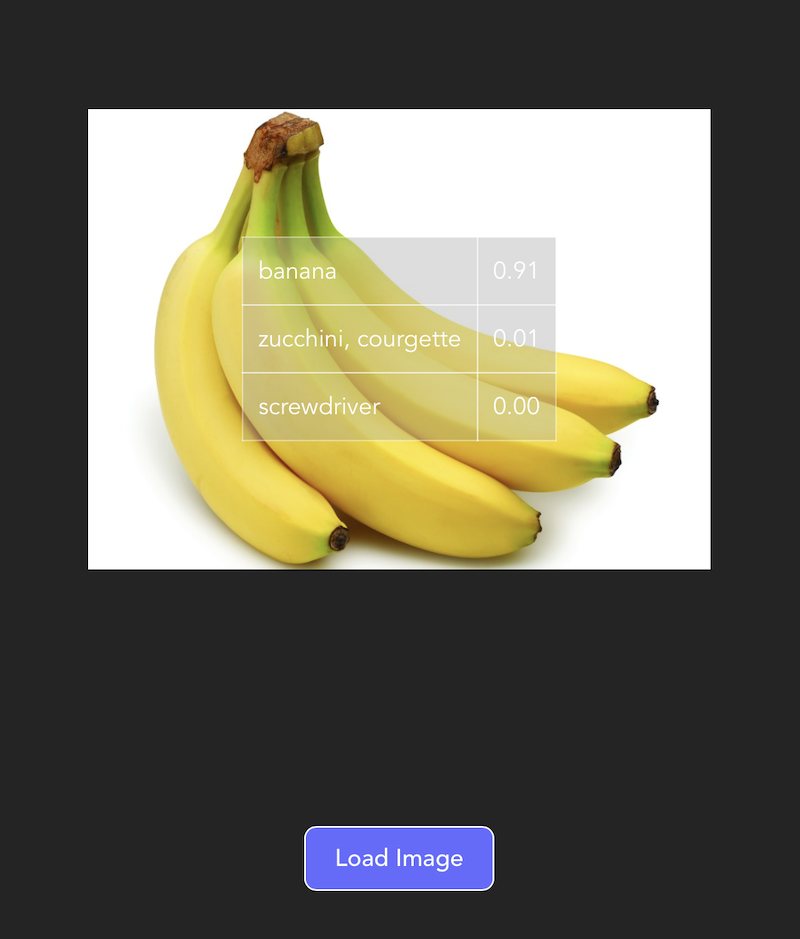

react-ml5-sample
======

This React project is bootstrapped using [Vite](https://vitejs.dev/guide/).

# Goal

The goal of this project is to explore [ml5.js](https://learn.ml5js.org), the machine learning library for Javascript.

I made a simple implementation of image classifier app using ml5.js.





User can load image or take picture (if using mobile device/tablet).

After the image is loaded and referenced passed via `useRef`, the `ImageClassifier` method is called and loaded with `MobileNet` model.

One can use either `callback` or `Promise` style. I used `Promise` for convenience.


```javascript
const result = await ml5.imageClassifier('MobileNet').then(classifier => classifier.predict(imageRef.current))
```

Based from my testing, some common objects are not predicted correctly.

However, it is also possible to [load your own model](https://learn.ml5js.org/#/reference/image-classifier?id=description) so if you have a specific sets of images, you can train your own custom image classification model using [Google's Teachable Machine](https://teachablemachine.withgoogle.com/io19).

```javascript
const classifier = ml5.imageClassifier('/path/to/your-model.json', handleOnModelLoad)
```


# Getting Started

Clone the repository, install the dependencies and run

```sh
$ git clone https://github.com/supershaneski/react-ml5-sample.git myproject

$ cd myproject

$ npm install

$ npm start
```

Your browser will open to `http://localhost:3000/` or some other port depending on the availability.
